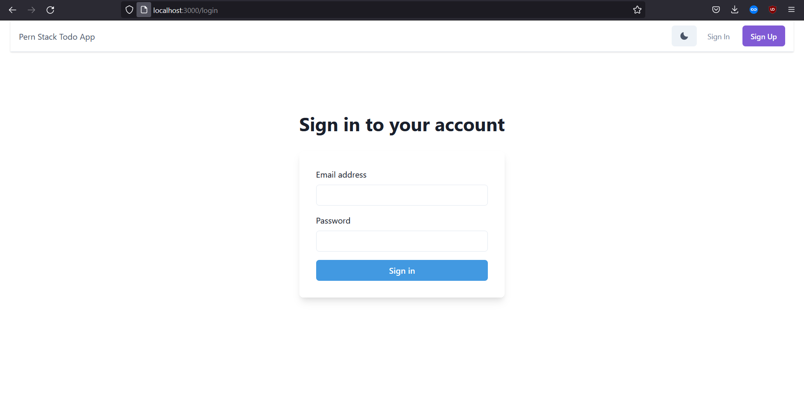
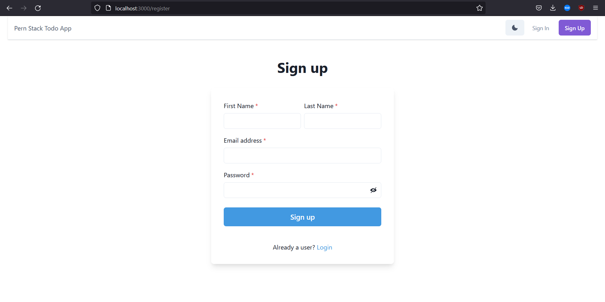

## Full Stack Todo App developed with PostgreSQL, Express.js, Node.js, React.js and JWT by akifz21

### To run locally the app

#### Start server

`cd server && node index.js`

#### Start client

`cd client && npm start`

#### DB

1. Install postgreSQL
2. Create authtodo DB with script in database.sql

### Project Images :

**Main**

**Login**

**Register**

**User Todos**

**Update Todo**

**Dark Mode**
